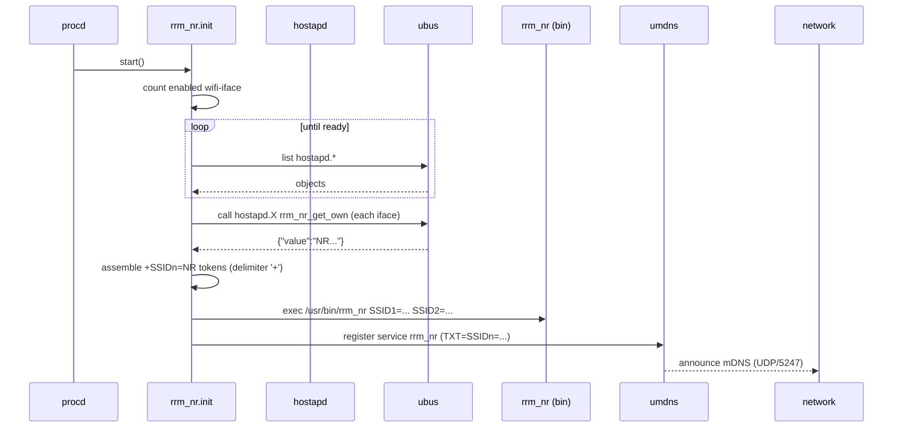

802.11k Neighbor Report (NR) Distributor
=======================================

Distributes per‑BSS 802.11k Neighbor Report data across a set of OpenWrt APs using mDNS so clients (and higher‑level steering logic) can discover other BSSes of the same ESS quickly. The provided init script collects each hostapd instance's own NR data and exposes it as TXT records of an mDNS service (`_rrm_nr._udp` / port 5247).

## Features

- Multi‑radio / multi‑band support (sequential `SSIDn=` TXT records)
- Helps band / BSS steering by advertising sibling BSS information
- Works once `umdns` is functioning (no extra controller needed)
- Minimal logging (single tag `rrm_nr`) but enough to diagnose startup

## Architecture

Component | Purpose
----------|--------
`service/rrm_nr.init` | procd init script: gathers NR data via `ubus`, formats TXT args, registers mDNS service
`bin/rrm_nr` | Opaque daemon consuming positional `SSIDn=<value>` args (prebuilt; no source here)
`lib/rrm_nr_common.sh` | Shared POSIX helpers (adaptive retry, iface mapping, millisecond sleep abstraction, probes)
`examples/wireless.config` | Example `/etc/config/wireless` enabling 802.11k (`ieee80211k '1'`, `bss_transition '1'`)

### Data Flow Summary
1. Count enabled `wifi-iface` stanzas (skip those with `option disabled '1'`).
2. Wait until that many `hostapd.*` objects appear on `ubus` (ensures hostapd ready).
3. For each `hostapd.*`: call `ubus call <obj> rrm_nr_get_own` → JSON `{"value":"..."}`.
4. Build concatenated string `+SSID<n>=<value>` (delimiter `+` chosen because invalid in SSIDs) then split into positional args.
5. Start daemon & register mDNS `rrm_nr` UDP/5247 with those TXT records.

### Startup Sequence (Mermaid)



## Installation

You have three progressively more automated options:

### 1. Quick Scripted Install (Recommended)

On the target OpenWrt device (copy the repo over or clone with git if available):

```sh
# assuming repository now at /tmp/rrm_nr_src (e.g. scp -r ./ root@ap:/tmp/rrm_nr_src )
cd /tmp/rrm_nr_src
sh scripts/install.sh
```

Options:
- `--no-start` only stage files (don’t enable/start service)
- `--force-config` overwrite existing `/etc/config/rrm_nr`
- `--add-sysupgrade` append required paths to `/etc/sysupgrade.conf` for persistence
- `--prefix /overlay` stage into another root (image build workflows)

### 2. Manual Copy (Minimalistic)

1. Ensure radios share a common ESSID where you want neighbor data propagated.
2. Enable 802.11k + BSS transition in each interface:
	- `option ieee80211k '1'`
	- `option bss_transition '1'`
3. Ensure `umdns` is installed & running (`opkg install umdns`).
4. Copy files:
	```sh
	cp service/rrm_nr.init /etc/init.d/rrm_nr
	cp bin/rrm_nr /usr/bin/rrm_nr
	cp lib/rrm_nr_common.sh /lib/rrm_nr_common.sh 2>/dev/null || true
	chmod +x /etc/init.d/rrm_nr /usr/bin/rrm_nr
	/etc/init.d/rrm_nr enable
	/etc/init.d/rrm_nr start
	```
5. Verify basic operation:
	```sh
	logread | grep rrm_nr
	ubus call umdns browse | grep SSID1=
	/etc/init.d/rrm_nr status
	```

### 3. Image / SDK Integration (Package Skeleton)

This repository now includes a ready package skeleton under `package/rrm-nr-distributor/`.

Quick build (inside an OpenWrt buildroot):
```sh
cp -r package/rrm-nr-distributor <openwrt-root>/package/
make menuconfig   # Network -> rrm-nr-distributor (select <M> or <*> )
make package/rrm-nr-distributor/compile V=sc
```

Resulting ipk (example): `bin/packages/<target>/base/rrm-nr-distributor_*.ipk`.

Install on device:
```sh
opkg install rrm-nr-distributor_*.ipk
```

Notes:
- Prebuilt daemon binary is shipped as-is (no compilation step). Replace with source + build logic later if available.
- Default config installed at `/etc/config/rrm_nr` (marked as conffile, preserved across upgrades).
- Helper library `lib/rrm_nr_common.sh` and init script installed automatically.

### Post-Install Checklist

- `logread | grep rrm_nr` shows a line "All wireless interfaces are initialized." followed by periodic update lines (if debug enabled).
- `ubus call umdns browse` contains TXT records `SSID1=...` etc.
- `/etc/init.d/rrm_nr status` shows current effective runtime values.
- Install script warnings: if any `wifi-iface` lacks `ieee80211k '1'` or `bss_transition '1'` (and is not disabled) you will see a WARNING prompting you to enable them for proper neighbor reports.

### Uninstall

```sh
/etc/init.d/rrm_nr stop
/etc/init.d/rrm_nr disable
rm -f /etc/init.d/rrm_nr /usr/bin/rrm_nr /lib/rrm_nr_common.sh
# Optional: remove config/state
rm -f /etc/config/rrm_nr /tmp/rrm_nr_runtime /tmp/rrm_nr_metrics
```

### Optional micro-sleep (usleep) dependency

The init script performs a short adaptive retry loop (200ms cadence, ≤1s total) when gathering initial `rrm_nr_get_own` values. On typical vanilla OpenWrt images `usleep` is NOT present (BusyBox `sleep` has 1s resolution). The script automatically detects this:

* If `usleep` exists (e.g. via `busybox-extras` or `coreutils-sleep`), it sleeps for true 200ms steps.
* If absent, it degrades to a single 1s sleep (effectively a one-shot retry). Elapsed accounting ensures we still bound total wait time.

Installing a micro-sleep implementation (optional):
```
opkg update
opkg install coreutils-sleep   # or a busybox providing usleep
```
This is purely an optimization; functionality still works without it, but initial readiness detection may be up to ~1s slower on hardware where readiness is actually ~0.2s.

## Configuration (UCI)

Config file `/etc/config/rrm_nr`:

```
config rrm_nr 'global'
	option enabled '1'                 # Set to 0 to disable service startup
	option update_interval '60'        # Seconds between update cycles (min 5 enforced)
	option jitter_max '10'             # Adds 0..jitter_max random seconds each cycle (capped at half interval)
	option debug '0'                   # Set to 1 for verbose debug logging (daemon.debug)
	option umdns_refresh_interval '30' # Minimum seconds between umdns update calls
	option umdns_settle_delay '0'      # Extra seconds to sleep immediately after an umdns update (default 0)
```

Live changes: Most runtime tunables (intervals, jitter, debug, umdns refresh, settle delay, skip_iface) can be reloaded without a full restart:

```sh
uci set rrm_nr.global.update_interval=45
uci commit rrm_nr
/etc/init.d/rrm_nr reload   # sends SIGHUP; daemon re-reads UCI values
```

Full restart still required only if you change structural aspects before daemon start (e.g. enabling/disabling service) or to clear internal state forcibly.

Environment mapping (init script → daemon):
- `RRM_NR_UPDATE_INTERVAL` → `UPDATE_INTERVAL`
- `RRM_NR_JITTER_MAX` → `JITTER_MAX`
- `RRM_NR_DEBUG` → enables debug log path
- `RRM_NR_UMDNS_REFRESH_INTERVAL` → `UMDNS_REFRESH_INTERVAL`
- `RRM_NR_QUICK_MAX_MS` → max milliseconds spent in first-pass adaptive iface readiness (default 2000, cap 5000)
- `RRM_NR_SECOND_PASS_MS` → delay in milliseconds before the targeted second-pass fetch (default 800, cap 1500)

All options are optional; defaults are compiled into the script.

Numeric validation & bounds:
- update_interval: minimum 5 enforced (values <5 auto-raised to 5)
- jitter_max: capped to half of effective update_interval
- umdns_refresh_interval: minimum 5 enforced
- umdns_settle_delay: forced >=0 (negative coerced to 0)
Out-of-range values are sanitized silently; check `/etc/init.d/rrm_nr status` after reload for effective applied values.

### Skipping Interfaces

Add one `list skip_iface '<iface>'` per interface (names are the portion after `hostapd.`). Example:

```
config rrm_nr 'global'
	list skip_iface 'wlan0'
	list skip_iface 'wlan1-1'
```

You may (optionally) include a `hostapd.` prefix; it will be stripped automatically (e.g. `hostapd.wlan0`).

Skipped interfaces are omitted from TXT assembly and neighbor list updates.

### Reloading Configuration

`/etc/init.d/rrm_nr reload` triggers a SIGHUP which now:

1. Re-reads UCI for: update_interval, jitter_max, umdns_refresh_interval, umdns_settle_delay, debug, skip_iface.
2. Applies sanity caps (min 5s interval; jitter ≤ half interval; umdns refresh ≥5s).
3. Rebuilds interface→SSID mapping and reapplies skip list.
4. Logs a concise before→after summary (`Reload (SIGHUP): U=60 J=10 ... -> U=45 J=5 ...`). If any timing shrinks, the current sleep is interrupted for an immediate cycle.

Status:
```
/etc/init.d/rrm_nr status
```
Shows current effective runtime values (from `/tmp/rrm_nr_runtime`).

Next cycle uses the new timing immediately; current sleep is unaffected until next iteration (keeps logic simple and race‑free).

## Example Wireless Config Snippet

See `examples/wireless.config` for a dual‑band setup. Key lines:
```
option ieee80211k '1'
option bss_transition '1'
option time_advertisement '2'
```

## Troubleshooting

Symptom | Check
--------|------
Service never starts | `logread` for errors about missing `/etc/config/wireless` or zero interfaces.
Hangs at "Waiting for all wireless interfaces" | `ubus list hostapd.*` count vs enabled `wifi-iface` stanzas; ensure no disabled ones assumed active.
Missing TXT records | Confirm `umdns` running and firewall allows mDNS; inspect assembly by temporarily adding a `logger -t rrm_nr "$rrm_own"` before `procd_open_instance`.
Immediate restart with wpad restart | Likely ubus exit code 4 from `rrm_nr_get_own`; watch for upstream OpenWrt bug reference (see init script comment).

## Extending

- Per‑interface opt‑out (planned): add `option rrm_nr_disable '1'`; modify both counting loop and per‑`hostapd` iteration to skip.
- Additional feature TXT flags: Append `+FEATURE=val` to the concatenated string after all `SSIDn=` entries (keep ordering stable).
- Retry logic: If adding retries for non‑4 ubus failures, bound attempts (e.g. 3) and log only once per interface.

### Developer Hygiene

Run shell lint & basic install script tests (if you have `shellcheck` installed):

```
chmod +x scripts/shellcheck.sh
./scripts/shellcheck.sh
sh tests/scripts/test_install.sh
```

Pass `--fix` later if auto-fix logic is introduced (currently just reports).

## Design Notes

- Delimiter `+` is intentional (invalid in SSIDs) – do not change; consumers rely on `SSIDn=` prefix ordering.
- Minimal dependencies: BusyBox POSIX shell only (avoid `[[` and arrays). `jsonfilter` is assumed present on OpenWrt.
- Assumes hostapd exposes `rrm_nr_get_own`; if upstream API changes, implement a fallback probe sequence.
- Adaptive quick retry: uses 200ms increments when high-resolution sleep available, else degrades gracefully to a single 1s wait (bounded). No hard multi-second delay is baked in; timing analysis shows typical readiness ≤0.2s on tested hardware.
	- After initial assembly you will see a concise line: `Assembled <n> SSID entries (config-skipped X, not-ready Y)` (or `(no skips)` when both zero) summarizing startup coverage.
	- On reload (SIGHUP) a summary differentiates `config-skipped` (explicitly excluded via UCI) vs `not-ready` (hostapd object returned no value): `Reload assembled <n> SSID entries (config-skipped X, not-ready Y)`.

### Persistence Across Upgrades (sysupgrade)

To keep files across firmware flashes, add these lines to `/etc/sysupgrade.conf` (or use `sh scripts/install.sh --add-sysupgrade`):
```
/etc/init.d/rrm_nr
/usr/bin/rrm_nr
/lib/rrm_nr_common.sh
```
Note: UCI configs in `/etc/config/*` (including `/etc/config/rrm_nr`) are already preserved by sysupgrade; no need to list them.

Manual addition:
```sh
for f in /etc/init.d/rrm_nr /usr/bin/rrm_nr /lib/rrm_nr_common.sh; do
	grep -qx "$f" /etc/sysupgrade.conf || echo "$f" >> /etc/sysupgrade.conf
done
```

Verify later:
```sh
grep rrm_nr /etc/sysupgrade.conf
```

### Installing Dependencies (opkg / apk)

Runtime tools normally present: `ubus`, `jsonfilter`, `iwinfo`, `umdns`. If missing:

Using opkg (traditional):
```sh
opkg update
opkg install umdns jsonfilter iwinfo
```

Using apk (emerging images):
```sh
apk update
apk add umdns jsonfilter iwinfo
```

Optional high-resolution sleep:
```sh
opkg install coreutils-sleep   # or
apk add coreutils
```

## Limitations

- Large deployments (>20 AP) may see slower convergence as `umdns` propagates updates (multi‑iteration minutes).
- Binary daemon not included in source form here; cannot currently rebuild.

## License

GPLv2 – see `LICENSE`.

## Quick One‑Liner (Elevator Pitch)

Collect each hostapd's 802.11k neighbor report and advertise them via mDNS TXT records so peer APs (same ESS) can rapidly share steering hints.

